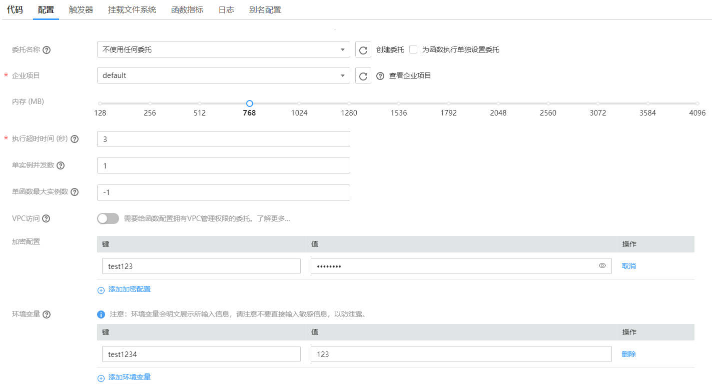

# 环境变量

设置FunctionGraph函数的加密配置和环境变量，无需对代码进行任何更改，可以将设置动态参数传递到函数代码和库，如[图1](#fig167011342519)所示。

**图 1**  设置变量  

例如Node.js语言加密配置和环境变量的值\(value\)可以通过Context类中的getUserData\(string key\)获取，详细请参见[Node.js函数开发指南](https://support.huaweicloud.com/devg-functiongraph/functiongraph_02_0410.html)。其他语言的环境变量的值\(value\)获取方法请参见[如何开发函数](https://support.huaweicloud.com/devg-functiongraph/functiongraph_02_0400.html)。

> **警告：** 
>-   设置加密配置、环境变量时，用户自定义的键\(key\)/值\(value\)，键\(key\)输入规范：可包含字母、数字、下划线\_，以大/小写字母开头。
>-   设置“键”和“值”的总长度不超过2048个字符。

