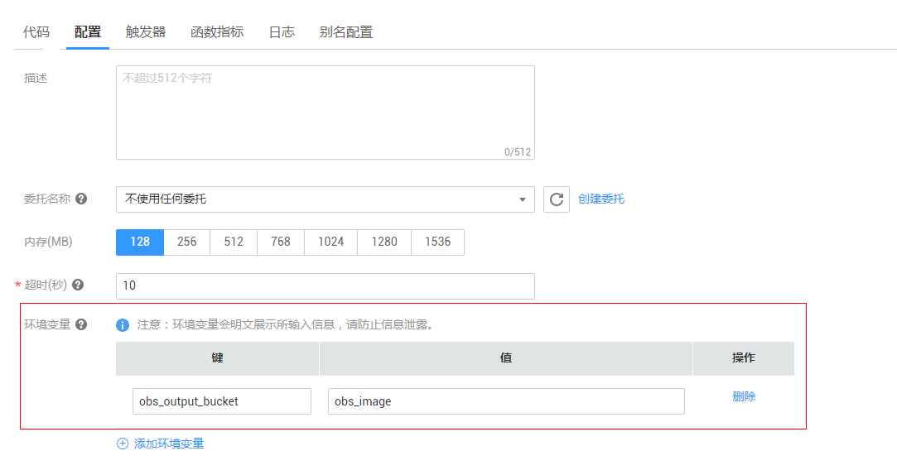

# 环境变量

设置FunctionGraph函数的环境变量，无需对代码进行任何更改，可以将设置动态参数，传递到函数代码和库，如[图1](#fig583332685511)所示。

**图 1**  设置环境变量  

环境变量是使用FunctionGraph控制台作为函数配置的一部分创建并修改的密钥值对。FunctionGraph函数随后会使用相应语言所支持的标准API（如适用于Node.js函数的process.env）将这些密钥值对提供给您的函数代码。

使用环境变量帮助库了解以下信息：安装文件的目录、存储输出的位置、存储连接和日志记录设置等。这些设置与应用程序逻辑解耦，在需要变更设置时，无需更新函数代码。

> **警告：**   
>设置环境变量时，用户自定义的键\(key\)/值\(value\)值，键\(key\)输入规范：可包含字母、数字、下划线\_，以大/小写字母开头。环境变量不超过20组，“键”和“值”的总长度不超过2048个字符，FunctionGraph会明文展示所有输入信息，请不要输入敏感信息（如账户密码等），以防止信息泄露。  

