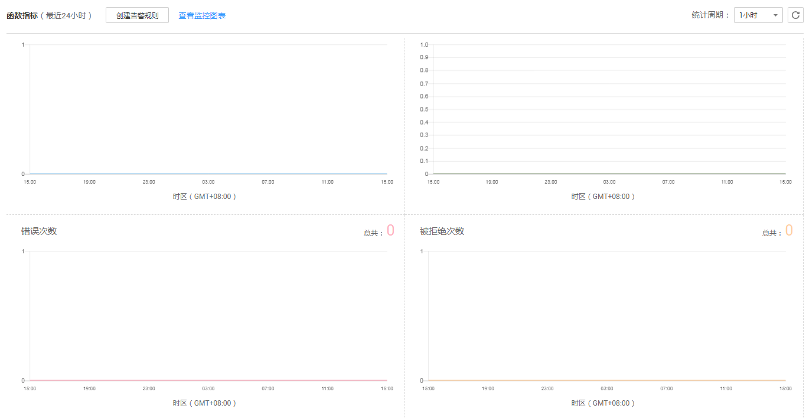
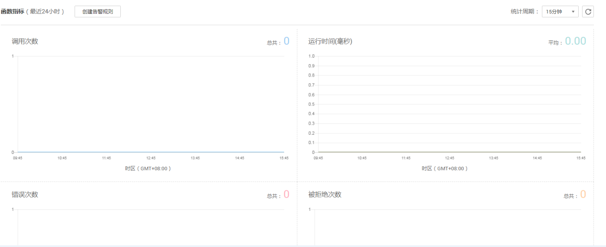

# 监控信息说明

FunctionGraph函数实现了与云监控服务的对接，用户无需任何配置，即可查询函数监控信息。

## 函数监控信息

可以查看租户所有函数及单个函数的监控信息。

-   租户监控信息

    在总览界面，可以查看租户所有函数的监控信息，监控指标包括调用次数、运行时间（包括最大运行时间、最小运行时间、平均运行时间）、错误次数、被拒绝次数，如[图1](#fig44304183715)所示，详情请参考[总览](总览.md)。

    **图 1**  租户监控信息  
    

-   函数监控信息

    不同版本函数的监控信息做了区分，查询函数指标之前设置函数版本，可以查询不同版本对应的监控信息。

    在函数详情页“函数指标”页签，可以查看监控信息，监控指标包括调用次数、运行时间（包括最大运行时间、最小运行时间、平均运行时间）、错误次数、被拒绝次数，如[图2](#fig179401719161011)所示，详情请参考[监控函数](函数监控.md#section10908414121714)。

    **图 2**  函数指标  
    

    -   创建告警规则

    通过创建告警规则，函数上报云监控服务的监控指标。

    在函数详情页“函数指标”页签，单击“创建告警规则”，输入监控指标及策略等，然后点击“进入查看”，进入云监控服务“告警规则”界面可以看到所创建的告警规则。点击操作栏中的“查看监控图表”，在云监控服务界面查看函数的监控指标详情，如[图3](#fig18767526123712)所示。

    **图 3**  查看监控图表  
    

