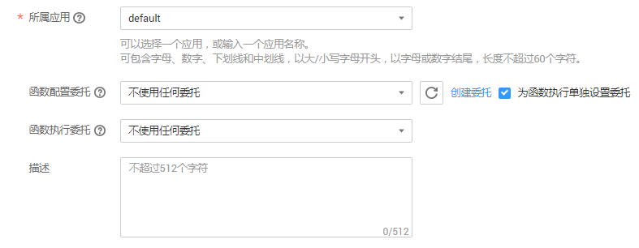

# 镜像上传方式创建函数

FunctionGraph支持上传用户自带的镜像，用户在创建函数时可以将自己制作的镜像上传到函数服务，函数服务在执行函数时会加载用户镜像。

1.  登录FunctionGraph，进入“函数”界面。
2.  在“函数”界面，选择“函数列表”，单击“创建函数”，进入“创建函数”界面。
3.  在“创建方式“栏选择“镜像上传“。
4.  在“创建函数”界面填写函数信息。

    填写基础配置信息，如[表1](#table13922957165319)所示，带\*参数为必填项。

    **表 1**  函数基础配置信息表

    
    <table><thead align="left"><tr id="row129222577535"><th class="cellrowborder" valign="top" width="50%" id="mcps1.2.3.1.1">
参数

    </th>
    <th class="cellrowborder" valign="top" width="50%" id="mcps1.2.3.1.2">
说明

    </th>
    </tr>
    </thead>
    <tbody><tr id="row1392295713536"><td class="cellrowborder" valign="top" width="50%" headers="mcps1.2.3.1.1 ">
*函数名称

    </td>
    <td class="cellrowborder" valign="top" width="50%" headers="mcps1.2.3.1.2 ">
函数名称，命名规则如下：

    <ul id="ul1992245715539"><li>可包含字母、数字、下划线和中划线，长度不超过60个字符。</li><li>以大/小写字母开头，以字母或数字结尾。</li></ul>
    
输入HelloWorld。

    </td>
    </tr>
    <tr id="row15922165725317"><td class="cellrowborder" valign="top" width="50%" headers="mcps1.2.3.1.1 ">
*所属应用

    </td>
    <td class="cellrowborder" valign="top" width="50%" headers="mcps1.2.3.1.2 ">
用户创建函数时可以进行分组，每个函数应用下面可以创建多个函数，在函数创建时可以指定其归属于某个函数应用。命名规则如下：

    <ul id="ul109221257195319"><li>可包含字母、数字、下划线和中划线，长度不超过60个字符。</li><li>以大/小写字母开头，以字母或数字结尾。</li></ul>
    
选择默认的“default”应用。

    </td>
    </tr>
    <tr id="row15922195716533"><td class="cellrowborder" valign="top" width="50%" headers="mcps1.2.3.1.1 ">
委托名称

    </td>
    <td class="cellrowborder" valign="top" width="50%" headers="mcps1.2.3.1.2 ">
用户委托函数工作流服务去访问其他的云服务，则需要提供权限委托，创建委托，请参考<a href="创建委托.md">创建委托</a>。

    
如果用户函数不访问任何云服务，则不用提供委托名称。

    
本例选择“不使用任何委托”。

    </td>
    </tr>
    <tr id="row392205715535"><td class="cellrowborder" valign="top" width="50%" headers="mcps1.2.3.1.1 ">
函数描述

    </td>
    <td class="cellrowborder" valign="top" width="50%" headers="mcps1.2.3.1.2 ">
对函数的描述，不超过512个字符。输入test。

    </td>
    </tr>
    </tbody>
    </table>

    > **说明：**   
    >-   在创建函数过程中选择委托时，勾选“为函数执行单独设置委拖”时，弹出“触发器委托”栏，函数执行委托与触发器委托可独立设置，这将减小不必要的性能损耗；不勾选，函数执行和触发器将使用同一委托。如[图1](#fig11875175135113)所示。  
    >    **图 1**  设置委托    
    >      
    >    1.  触发器委托，如果函数需要创建DMS或DIS触发器，则需要配置具有DMS或DIS访问权限的委托。  
    >    2.  函数执行委托配置后用户可以通过函数执行入口方法中的context参数获取具有委托中权限的token、ak、sk，用于访问其他云服务。  

5.  上传镜像模板地址。进入“我的镜像“复制已上传镜像的模板地址，如[图2](#fig15373103613617)所示。上传镜像及获取镜像下载等操作请参考[容器镜像服务基本操作](https://support.huaweicloud.com/usermanual-swr/swr_01_0011.html)。

    **图 2**  复制模板  
    

    > **说明：**   
    >上传的镜像需设置为“公开”，如[图3](#fig1437420363368)所示。  
    >**图 3**  编辑镜像    
    >  

6.  将已复制的镜像模板地址输入“镜像模板地址”栏，如[图4](#fig4216102120441)所示。

    **图 4**  输入模板地址  
    

7.  在页面右侧查看函数配置及计费信息，确认无误后，单击“创建函数”，完成函数创建。如[图5](#fig1278822118284)所示。

    **图 5**  使用镜像上传创建函数  
    

    > **说明：**   
    >-   函数创建成功后，函数内存配置为128MB，超时时间设置为3秒，如果需要修改配置，请参考[修改函数配置](函数管理.md#section1560314348363)。  
    >-   测试函数内容请参考[测试函数](代码上传方式创建HelloWorld函数.md#section72232178461)。  
    >-   用户创建镜像文件时可以使用创建函数时使用的环境变量和事件，分别为“EVENT\_CONTENT”和“user\_data”中的“键”。如[图6](#fig1302143052617)所示。  
    >    **图 6**  键    
    >      

