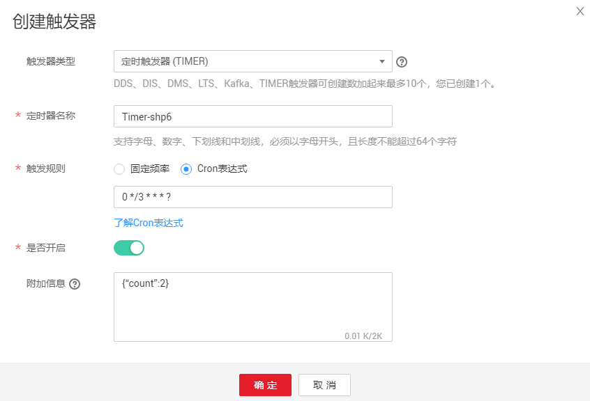

# 预留实例管理<a name="ZH-CN_TOPIC_0241013219"></a>

## 什么是预留实例？<a name="section36993910598"></a>

函数工作流提供了按量和预留两种类型的实例。

-   按量实例的创建和释放由函数工作流管理，当函数工作流收到函数的调用请求时，自动为此请求分配执行环境。
-   预留实例是将函数实例的创建和释放交由用户管理，当您为某一函数创建了预留实例，函数工作流收到此函数的调用请求时，会优先将请求转发给您的预留实例，当请求的峰值超过预留实例处理能力时，剩余部分的请求将会转发给按量实例，由函数工作流自动为您分配执行环境。

    预留实例在创建完成后，会自动加载该函数的代码、依赖包以及执行初始化入口函数，且预留实例会常驻环境，消除冷启动对业务的影响。

    > **说明：**   
    >用户默认没有权限使用预留实例，如果需要使用预留实例功能，请在[工单系统](https://console.huaweicloud.com/ticket/?agencyId=e4ebeeb18baa4ae58946b5342fa6159d#/ticketindex/createIndex)提交工单添加白名单。  


您可以直接创建或者通过函数创建预留实例，两者的区别如下：

**表 1**  两种方式创建预留实例的区别

<a name="table176891912141320"></a>
<table><thead align="left"><tr id="row4690312121318"><th class="cellrowborder" valign="top" width="20.692069206920692%" id="mcps1.2.4.1.1"><p id="p269041219138"><a name="p269041219138"></a><a name="p269041219138"></a>创建方式</p>
</th>
<th class="cellrowborder" valign="top" width="38.15381538153815%" id="mcps1.2.4.1.2"><p id="p136902120135"><a name="p136902120135"></a><a name="p136902120135"></a>优点</p>
</th>
<th class="cellrowborder" valign="top" width="41.154115411541156%" id="mcps1.2.4.1.3"><p id="p19690191201320"><a name="p19690191201320"></a><a name="p19690191201320"></a>缺点</p>
</th>
</tr>
</thead>
<tbody><tr id="row1623773491416"><td class="cellrowborder" valign="top" width="20.692069206920692%" headers="mcps1.2.4.1.1 "><p id="p1023813417144"><a name="p1023813417144"></a><a name="p1023813417144"></a>直接创建</p>
</td>
<td class="cellrowborder" valign="top" width="38.15381538153815%" headers="mcps1.2.4.1.2 "><p id="p14834313185"><a name="p14834313185"></a><a name="p14834313185"></a>创建步骤简单，易操作</p>
</td>
<td class="cellrowborder" valign="top" width="41.154115411541156%" headers="mcps1.2.4.1.3 "><p id="p6238143421412"><a name="p6238143421412"></a><a name="p6238143421412"></a>只能创建固定个数的预留实例，可能导致繁忙时预留实例不够用，或者空闲时，预留实例资源浪费</p>
</td>
</tr>
<tr id="row12690612101313"><td class="cellrowborder" valign="top" width="20.692069206920692%" headers="mcps1.2.4.1.1 "><p id="p1169012120130"><a name="p1169012120130"></a><a name="p1169012120130"></a>通过函数创建</p>
</td>
<td class="cellrowborder" valign="top" width="38.15381538153815%" headers="mcps1.2.4.1.2 "><p id="p569071221316"><a name="p569071221316"></a><a name="p569071221316"></a>支持创建不同时间段不同数量的预留实例，避免繁忙时预留实例不够用，或者空闲时，预留实例资源浪费</p>
</td>
<td class="cellrowborder" valign="top" width="41.154115411541156%" headers="mcps1.2.4.1.3 "><p id="p1769017122132"><a name="p1769017122132"></a><a name="p1769017122132"></a>创建步骤繁杂</p>
</td>
</tr>
</tbody>
</table>

## 直接创建固定个数的预留实例<a name="section1064812184016"></a>

直接创建固定个数的预留实例前，确保FunctionGraph控制台中已存在需要创建预留实例的目标函数，例如Objective-func。

1.  登录FunctionGraph控制台，在左侧导航栏选择“函数 \> 预留实例列表”，进入“预留实例列表”界面。
2.  单击“配置预留实例”，弹出“配置预留实例”对话框。
3.  设置以下信息。

    **表 2**  预留实例信息

    <a name="table998295982811"></a>
    <table><thead align="left"><tr id="row169821959152818"><th class="cellrowborder" valign="top" width="22.38%" id="mcps1.2.3.1.1"><p id="p149826597284"><a name="p149826597284"></a><a name="p149826597284"></a>参数</p>
    </th>
    <th class="cellrowborder" valign="top" width="77.62%" id="mcps1.2.3.1.2"><p id="p39821659142811"><a name="p39821659142811"></a><a name="p39821659142811"></a>参数说明</p>
    </th>
    </tr>
    </thead>
    <tbody><tr id="row2982125902817"><td class="cellrowborder" valign="top" width="22.38%" headers="mcps1.2.3.1.1 "><p id="p99822593280"><a name="p99822593280"></a><a name="p99822593280"></a>应用</p>
    </td>
    <td class="cellrowborder" valign="top" width="77.62%" headers="mcps1.2.3.1.2 "><p id="p18982185914281"><a name="p18982185914281"></a><a name="p18982185914281"></a>选择Objective-func所属的应用。</p>
    </td>
    </tr>
    <tr id="row998235932811"><td class="cellrowborder" valign="top" width="22.38%" headers="mcps1.2.3.1.1 "><p id="p12982175922811"><a name="p12982175922811"></a><a name="p12982175922811"></a>函数</p>
    </td>
    <td class="cellrowborder" valign="top" width="77.62%" headers="mcps1.2.3.1.2 "><p id="p99821259132815"><a name="p99821259132815"></a><a name="p99821259132815"></a>选择“Objective-func”。</p>
    </td>
    </tr>
    <tr id="row16983165918286"><td class="cellrowborder" valign="top" width="22.38%" headers="mcps1.2.3.1.1 "><p id="p11983125913283"><a name="p11983125913283"></a><a name="p11983125913283"></a>版本</p>
    </td>
    <td class="cellrowborder" valign="top" width="77.62%" headers="mcps1.2.3.1.2 "><p id="p298305914283"><a name="p298305914283"></a><a name="p298305914283"></a>选择Objective-func的版本。</p>
    </td>
    </tr>
    <tr id="row19983175932816"><td class="cellrowborder" valign="top" width="22.38%" headers="mcps1.2.3.1.1 "><p id="p4983165912285"><a name="p4983165912285"></a><a name="p4983165912285"></a>预留实例个数</p>
    </td>
    <td class="cellrowborder" valign="top" width="77.62%" headers="mcps1.2.3.1.2 "><p id="p49831459192814"><a name="p49831459192814"></a><a name="p49831459192814"></a>输入需要创建预留实例的个数。</p>
    <p id="p18358830143218"><a name="p18358830143218"></a><a name="p18358830143218"></a>您可以参考“资源统计”中统计的Objective-func实际运行使用的实例数，设置预留实例个数，或者根据Objective-func过往使用情况，设置预留实例个数。</p>
    </td>
    </tr>
    </tbody>
    </table>

4.  单击“确定”，完成预留实例的创建。

    > **说明：**   
    >预留实例创建完成后，只支持修改预留实例的个数。  


## 通过函数创建数量可变的预留实例<a name="section516211925918"></a>

用户在不同的时间段，业务使用的实例数可能不一样，您可以通过定时触发器调用函数，为各个时间段设置不同的预留实例数，避免在业务繁忙时未设置预留实例，导致函数被冷启动影响业务或者在业务空闲时设置多个预留实例，导致资源闲置。

通过函数创建数量可变的预留实例前，确保FunctionGraph控制台中已存在需要创建预留实例的目标函数，例如Objective-func。

1.  登录FunctionGraph控制台，在左侧导航栏选择“函数 \> 函数列表”，进入函数列表界面。
2.  单击“创建函数”，进入“创建函数”界面。
3.  输入以下信息。

    <a name="table872019614134"></a>
    <table><thead align="left"><tr id="row1172015619136"><th class="cellrowborder" valign="top" width="22.38%" id="mcps1.1.3.1.1"><p id="p472036141313"><a name="p472036141313"></a><a name="p472036141313"></a>参数</p>
    </th>
    <th class="cellrowborder" valign="top" width="77.62%" id="mcps1.1.3.1.2"><p id="p572017616136"><a name="p572017616136"></a><a name="p572017616136"></a>参数说明</p>
    </th>
    </tr>
    </thead>
    <tbody><tr id="row197208641310"><td class="cellrowborder" valign="top" width="22.38%" headers="mcps1.1.3.1.1 "><p id="p1968101115137"><a name="p1968101115137"></a><a name="p1968101115137"></a>模板</p>
    </td>
    <td class="cellrowborder" valign="top" width="77.62%" headers="mcps1.1.3.1.2 "><p id="p10967131115134"><a name="p10967131115134"></a><a name="p10967131115134"></a>选择“使用空模板”。</p>
    </td>
    </tr>
    <tr id="row672011618131"><td class="cellrowborder" valign="top" width="22.38%" headers="mcps1.1.3.1.1 "><p id="p129667112132"><a name="p129667112132"></a><a name="p129667112132"></a>函数名称</p>
    </td>
    <td class="cellrowborder" valign="top" width="77.62%" headers="mcps1.1.3.1.2 "><p id="p8965011121319"><a name="p8965011121319"></a><a name="p8965011121319"></a>输入您自定义的函数名称，用于识别不同的函数。</p>
    </td>
    </tr>
    <tr id="row272118641310"><td class="cellrowborder" valign="top" width="22.38%" headers="mcps1.1.3.1.1 "><p id="p1396519117134"><a name="p1396519117134"></a><a name="p1396519117134"></a>所属应用</p>
    </td>
    <td class="cellrowborder" valign="top" width="77.62%" headers="mcps1.1.3.1.2 "><p id="p109648112132"><a name="p109648112132"></a><a name="p109648112132"></a>选择“default”。</p>
    </td>
    </tr>
    <tr id="row137211864132"><td class="cellrowborder" valign="top" width="22.38%" headers="mcps1.1.3.1.1 "><p id="p596315111132"><a name="p596315111132"></a><a name="p596315111132"></a>委托名称</p>
    </td>
    <td class="cellrowborder" valign="top" width="77.62%" headers="mcps1.1.3.1.2 "><p id="p159621511131318"><a name="p159621511131318"></a><a name="p159621511131318"></a>选择“不使用任何委托”。</p>
    </td>
    </tr>
    <tr id="row1257637171314"><td class="cellrowborder" valign="top" width="22.38%" headers="mcps1.1.3.1.1 "><p id="p025713710137"><a name="p025713710137"></a><a name="p025713710137"></a>描述</p>
    </td>
    <td class="cellrowborder" valign="top" width="77.62%" headers="mcps1.1.3.1.2 "><p id="p132572037161318"><a name="p132572037161318"></a><a name="p132572037161318"></a>输入您对函数的描述信息，可以不填。</p>
    </td>
    </tr>
    <tr id="row89251655181313"><td class="cellrowborder" valign="top" width="22.38%" headers="mcps1.1.3.1.1 "><p id="p15925185516132"><a name="p15925185516132"></a><a name="p15925185516132"></a>运行时语言</p>
    </td>
    <td class="cellrowborder" valign="top" width="77.62%" headers="mcps1.1.3.1.2 "><p id="p1092545561318"><a name="p1092545561318"></a><a name="p1092545561318"></a>选择“Python 2.7”。</p>
    </td>
    </tr>
    <tr id="row161242058151316"><td class="cellrowborder" valign="top" width="22.38%" headers="mcps1.1.3.1.1 "><p id="p151249588136"><a name="p151249588136"></a><a name="p151249588136"></a>函数执行入口</p>
    </td>
    <td class="cellrowborder" valign="top" width="77.62%" headers="mcps1.1.3.1.2 "><p id="p5124205818136"><a name="p5124205818136"></a><a name="p5124205818136"></a>输入“index.handler”。</p>
    </td>
    </tr>
    <tr id="row18842111148"><td class="cellrowborder" valign="top" width="22.38%" headers="mcps1.1.3.1.1 "><p id="p14845121418"><a name="p14845121418"></a><a name="p14845121418"></a>代码上传方式</p>
    </td>
    <td class="cellrowborder" valign="top" width="77.62%" headers="mcps1.1.3.1.2 "><p id="p5841118143"><a name="p5841118143"></a><a name="p5841118143"></a>选择“在线编辑”，输入如下代码。</p>
    </td>
    </tr>
    </tbody>
    </table>

    ```
    # -*- coding:utf-8 -*-
    import json
    import requests
    def handler (event, context):
        domainId = "https://{Endpoint}"
        url = "/v2/{project_id}/fgs/functions/{func-urn}/reservedinstances"
        token = context.getToken()
        requrl = domainId + url
        headerdata = {"Content-Type":"application/json","x-auth-token":token}
        r = requests.put(requrl, data=event["user_event"], headers=headerdata,verify=False)
    return r.json
    ```

    注意将上述代码中参数部分根据实际情况进行替换：

    -   Endpoint：Objective-func所在的终端节点，可以从[地区和终端节点](https://developer.huaweicloud.com/dev/endpoint)获取。
    -   project\_id：Objective-func所在的[项目ID](https://support.huaweicloud.com/api-functiongraph/functiongraph_06_0260.html)。
    -   func-urn：Objective-func的URN。

4.  单击“创建函数”，完成函数的创建。
5.  在“配置”页签，单击“创建委托”，进入“委托”界面。
6.  <a name="li114959152395"></a>创建“FunctionGraph User”权限的委托，具体参考[创建委托](创建委托.md)。
7.  返回“配置”页签，在“委托名称”中选择[6](#li114959152395)中创建为委托，单击“保存”，保存配置的委托。
8.  在“触发器”页签，单击“创建触发器”，弹出“创建触发器”对话框。
9.  输入以下信息。

    <a name="table108941521478"></a>
    <table><thead align="left"><tr id="row13894162116713"><th class="cellrowborder" valign="top" width="22.38%" id="mcps1.1.3.1.1"><p id="p178959211715"><a name="p178959211715"></a><a name="p178959211715"></a>参数</p>
    </th>
    <th class="cellrowborder" valign="top" width="77.62%" id="mcps1.1.3.1.2"><p id="p3895132119715"><a name="p3895132119715"></a><a name="p3895132119715"></a>参数说明</p>
    </th>
    </tr>
    </thead>
    <tbody><tr id="row2089519211072"><td class="cellrowborder" valign="top" width="22.38%" headers="mcps1.1.3.1.1 "><p id="p721912260716"><a name="p721912260716"></a><a name="p721912260716"></a>触发器类型</p>
    </td>
    <td class="cellrowborder" valign="top" width="77.62%" headers="mcps1.1.3.1.2 "><p id="p1021818268710"><a name="p1021818268710"></a><a name="p1021818268710"></a>选择“定时触发器（TIMER）”。</p>
    </td>
    </tr>
    <tr id="row6895122116715"><td class="cellrowborder" valign="top" width="22.38%" headers="mcps1.1.3.1.1 "><p id="p22175261370"><a name="p22175261370"></a><a name="p22175261370"></a>定时器名称</p>
    </td>
    <td class="cellrowborder" valign="top" width="77.62%" headers="mcps1.1.3.1.2 "><p id="p142141826375"><a name="p142141826375"></a><a name="p142141826375"></a>输入您自定义的触发器名称，用于识别不同的触发器。</p>
    </td>
    </tr>
    <tr id="row589510211772"><td class="cellrowborder" valign="top" width="22.38%" headers="mcps1.1.3.1.1 "><p id="p142121526579"><a name="p142121526579"></a><a name="p142121526579"></a>触发规则</p>
    </td>
    <td class="cellrowborder" valign="top" width="77.62%" headers="mcps1.1.3.1.2 "><p id="p142112026777"><a name="p142112026777"></a><a name="p142112026777"></a>选择“Cron表达式”，根据实际情况输入触发规则。</p>
    </td>
    </tr>
    <tr id="row189512211073"><td class="cellrowborder" valign="top" width="22.38%" headers="mcps1.1.3.1.1 "><p id="p92101626570"><a name="p92101626570"></a><a name="p92101626570"></a>是否开启</p>
    </td>
    <td class="cellrowborder" valign="top" width="77.62%" headers="mcps1.1.3.1.2 "><p id="p32091526474"><a name="p32091526474"></a><a name="p32091526474"></a>默认选择开启，无需修改。</p>
    </td>
    </tr>
    <tr id="row1789518212715"><td class="cellrowborder" valign="top" width="22.38%" headers="mcps1.1.3.1.1 "><p id="p72081726573"><a name="p72081726573"></a><a name="p72081726573"></a>附加信息</p>
    </td>
    <td class="cellrowborder" valign="top" width="77.62%" headers="mcps1.1.3.1.2 "><p id="p62076265715"><a name="p62076265715"></a><a name="p62076265715"></a>结合“触发规则”，输入不同时间段需要的预留实例数。</p>
    </td>
    </tr>
    </tbody>
    </table>

    **图 1**  创建定时触发器<a name="fig18551936144713"></a>  
    

    如[图1](#fig18551936144713)所示，创建了一个每隔3分钟创建2个预留实例的定时触发器。

10. 单击“确定”，完成触发器的创建。

    触发器创建完成后，Objective-func通过您创建的触发规则在不同时间段，创建数量不同的预留实例数。


